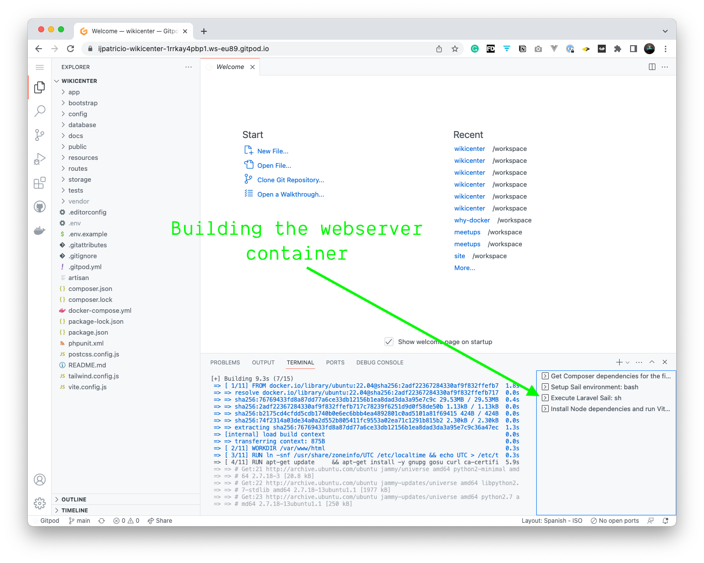
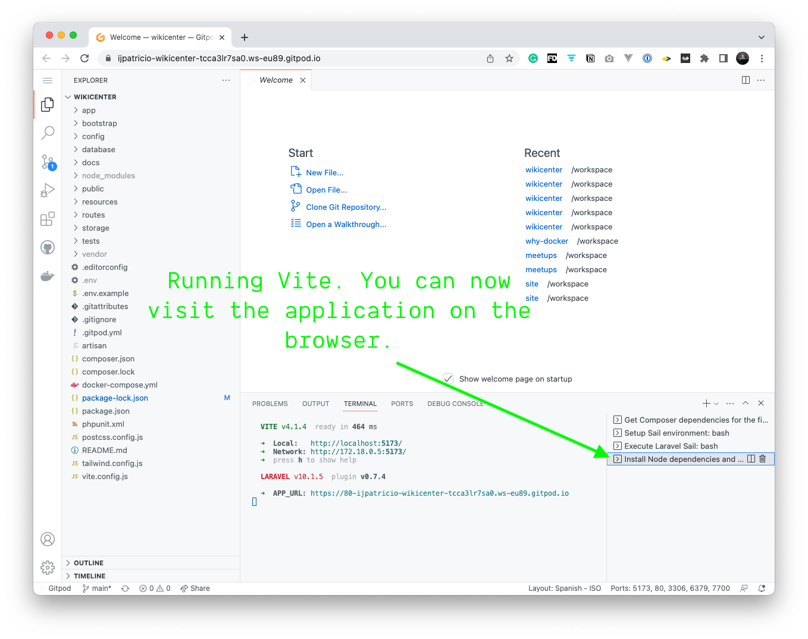
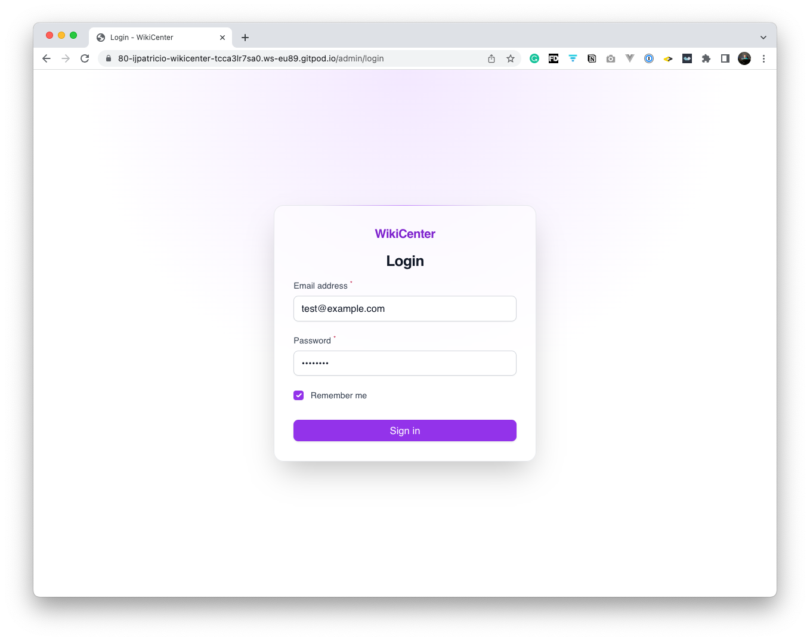

## About WikiCenter

It is a Wiki software :)

Visit [Youtube Playlist](https://www.youtube.com/watch?v=aRI9-DzXOkI&list=PL2Njk5tK9lmuM5Oac06vxILXJvoYS3Qrs) to 
see live coding sessions on this repository.

## Running WikiCenter on GitPod

GitPod is a Cloud Based Development Environment. It allows us to automate the creation of an environment on 
the cloud, to develop, check Features and PR previews live, onboarding people faster, pair programming, playgrounds, and more.

If you want to try if, go to [WikiCenter on GitPod](https://gitpod.io/#https://github.com/ijpatricio/wikicenter).
You can create an account in under a minute, using your Git provider of choice. You don't have to give any permissions to repositories,
only to read your e-mail address.

The GitPod setup for this repository was made on a [Youtube Live Session](https://www.youtube.com/watch?v=Ng1WW45Zlho&list=PL2Njk5tK9lmuM5Oac06vxILXJvoYS3Qrs&index=4).

The tasks in [.gitpod.yml](./.gitpod.yml) will run.



After all the 4 tasks are running, the last one keeps running `Vite`.



You can now visit the app, for the link provided on local 80. (It will be public 443 SSL)


Then run, in an available terminal, (or a new one):

```bash
./vendor/bin/sail artisan migrate:fresh --seed
```

And now you can navigate to `/admin`. The login form will be filled for you automatically, just click Login :)


## License

WikiCenter is open-sourced software licensed under the [MIT license](https://opensource.org/licenses/MIT).
