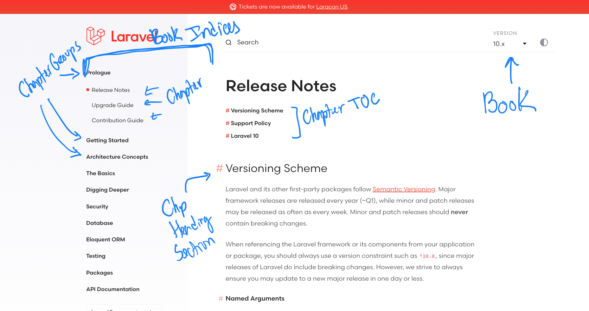

# TODO's

- [x] Can upload and manage media. Filament Curator
- [x] Can upload and manage media. Filament Curator
- [x] Can boot up development/preview environments. GitPod
- [ ] Can generate PDF, consider page breaks. From now on, every block must be able to print in the PDF view.
- [ ] Can generate dynamic documentations.
- Blocks:
  - [ ] Headings 1, 2
  - [ ] Image 
  - [ ] Code block (Shiki and copy button)
  - [ ] Callout
- Layout for having documentation
  - Documentation Area
    - Multiple books. We can change book (top right selector)
    - Books have Chapters. Chapter is a Fabricator Page. (set of blocks)
    - Chapter Groups are a convenient way to Present Books Indices

